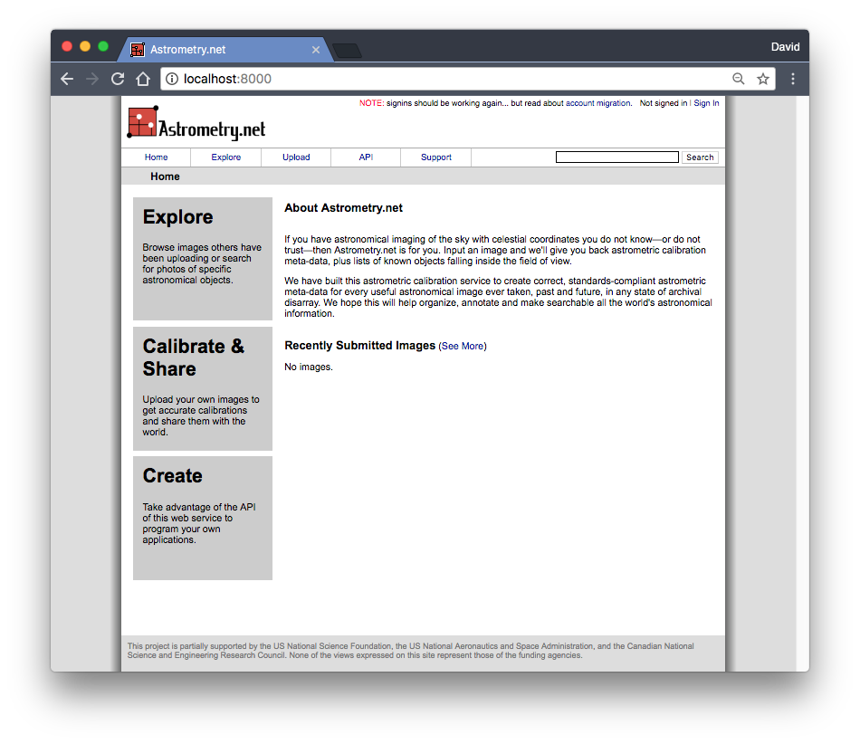

Astrometry.net ready out-of-the-box for local plate solving using Docker.

## Overview

I wanted to be able to spin up a local plate solver (including web API) and with (almost) zero configuration.  In my case, I use [astrometry.net](http://astrometry.net) (ADN) to assist building mount models for my telescope.  It would be nice to have an ADN server on a laptop, or perhaps a raspberry pi to give me ADN's capability even when I lack access to the interwebs.  This capability is similar to [ansvr](https://adgsoftware.com/ansvr/) on Windows, but will work on any operating system that can run Docker. (I really do not enjoy windows...)

My solution is a Docker image ([dm90/astrometry](https://hub.docker.com/r/dm90/astrometry/)) which:

* Has astrometry.net compiled and ready for use at the command line
* Has astrometry.net python libraries compiled added to the Python path
* Has a preconfigured Nova server (basic settings) that launches with a single command

I tried to provide some documentation of what's happening here.  Check out [base](./base), [astrometry](./astrometry), [nova](./nova), and [index](./index) for docs on each aspect of the build.

## Quick and Dirty

If you're a docker fiend, here you go:

`docker run -p 8000:8000 dm90/astrometry`

## Details

If you are familiar with Docker, usage is pretty straightforward.  If you're not familiar with Docker, do some research.  I'll be a bit verbose below just in case.  If you're running on a raspberry pi (or other ARM device) see [below](#Running on ARM Chipseets \(Raspberry Pi\))

### Download

Assuming you have Docker installed on your system, run:

`docker pull dm90/astrometry`

This could take a bit to download (I haven't attempted to shrink the image yet)

### Running the Nova Server

#### Using docker run

Can be launched with a single command.  For example:

`docker run --name nova --restart unless-stopped -v /my/index/data:/usr/local/astrometry/data -p 8000:8000 dm90/astrometry`

The command above starts a docker container using the `dm90/astrometry` image and:

* `--name nova` gives the container the name "nova"

* `--restart unless-stopped` restarts the container after errors/reboots

* `-v /my/index/data:/usr/local/astrometry/data` mounts your index files into the astrometry.net data directory

* `-p 8000:8000` exposes the container's web application on port 8000 on the host machine

#### Using docker-compose

The better way is to use docker-compose (see [docker-compose.yml](./docker-compose.yml)).  

Clone the repo, and change into the directory:

```
git clone https://github.com/dam90/astrometry.git nova
cd nova/
```

From that directory (which contains the `docker-compose.yml`) type:

`docker-compose up -d`

##### Compose and Index Data

By default [docker-compose.yml](./docker-compose.yml) looks for a docker volume named "astrometry_index".  If no such volume exists, comment out the line or create an empty one using:

`docker volume create astrometry_index`

See the [index README](./index) for more details.

### Test

Once the Docker container is running go to http://localhost:8000 (or replace "localhost" with your hostname or IP) and you should get the nova homepage:



#### Nova API

The web API also works.  Using api key `XXXXXXXX` (or just an empty string: `""`) hit this endpoint  http://localhost:8000/api. See [ADN docs](http://astrometry.net/doc/net/api.html) for details on the API.

## The Docker image doesn't work!

If the latest docker image isn't working on your host, try building it (slow, lame):

```
git clone https://github.com/dam90/astrometry.git astrometry
cd astrometry/
docker build -t astrometry:mybuild .
```

If the build actually finishes (should take a while) try this to run and view logs:

```
docker run --name nova_test -d -p 8000:8000 astrometry:mybuild
docker logs -f nova_test
```

I'd be interested to know if you have to do this, and what the outcome is.

## Index files

The docker image comes with only one index file for testing, so you'll probably want to add your own. See the [index README](./index) for a description of how to do this.

# Running on ARM Chipseets (Raspberry Pi)
My first go at this was on an Intel-based CentOS installation.  Once I got that working I made a separate set of install scripts for a Raspbian Docker image.  I've modified the docker build process so that when installing dependencies and compiling from source it first checks the chipset.

A raspberry pi compatible image is available using the `arm` tag:

`docker pull dm90/astrometry:arm`

If using docker-compose, set the `ARCH` environment variable before use:

`export ARCH=ARM`

If the `$ARCH` environment variable starts with "arm" (case-insensitive), it will use the `arm` docker image.
